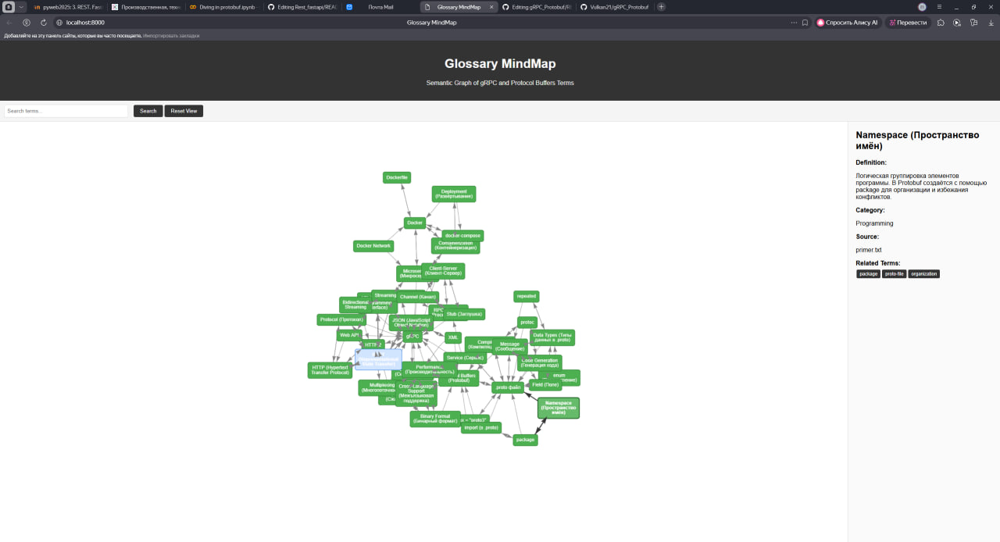

### Исследовательская задача в файле research.md
# gRPC Protobuf 

## Структура проекта

```
gRPC_Protobuf/
├── glossary/          # Глоссарий + MindMap (43 термина)
├── recommendations/   # gRPC сервис рекомендаций
├── marketplace/       # HTTP API
└── docker-compose.yml
```

## Быстрый старт

```bash
# Запуск
docker compose up --build -d

# Проверка
docker compose ps

# Остановка
docker compose down
```

## Доступ к сервисам

| Сервис | URL | Описание |
|--------|-----|----------|
| **Glossary MindMap** | http://localhost:8000 | Интерактивный граф терминов |
| **API Docs** | http://localhost:8000/docs | Swagger документация |
| **Marketplace** | http://localhost:5000 | HTTP API рекомендаций |

## API Примеры

```bash
# Получить все термины
curl http://localhost:8000/api/terms

# Поиск терминов
curl "http://localhost:8000/api/terms?query=grpc"

# Граф связей
curl http://localhost:8000/api/graph

# Рекомендации книг
curl http://localhost:5000/api/books/fantasy
```

## Управление

```bash
# Просмотр логов
docker compose logs -f

# Перезапуск
docker compose restart

# Полная очистка
docker compose down -v
```

## Технологии

- **Backend:** FastAPI, Flask, gRPC
- **Frontend:** HTML5, JavaScript, vis.js
- **Containerization:** Docker, docker-compose
- **Serialization:** Protocol Buffers

---
## Скриншот

